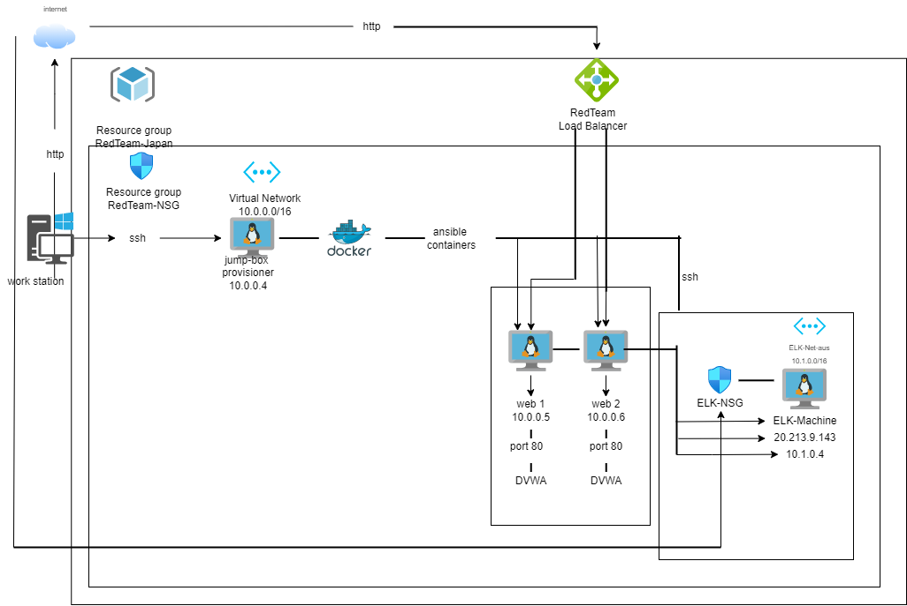
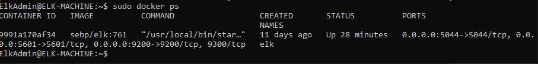

# ELK-Stack-Project
Elastic stack configured with docker and ansible 

## Automated ELK Stack Deployment

The files in this repository were used to configure the network depicted below.

These files have been tested and used to generate a live ELK deployment on Azure. They can be used to either recreate the entire deployment pictured above. 
Alternatively, select portions of the**YAML** file may be used to install only certain pieces of it, such as Filebeat.

  - [install-elk.yml](/ansible/ELK-stack/install-elk.yml)
  - [filebeat-config.yml](/ansible/filebeat-config.yml)
  - [filebeat-playbook.yml](/ansible/ELK-stack/filebeat-playbook.yml)
  - [metricbeat-config.yml](/ansible/metricbeat-config.yml)
  - [metricbeat-playbook.yml](/ansible/ELK-stack/metricbeat-playbook.yml)

This document contains the following details:
- Description of the Topology
- Access Policies
- ELK Configuration
  - Beats in Use
  - Machines Being Monitored
- How to Use the Ansible Build

### Description of the Topology

The main purpose of this network is to expose a load-balanced and monitored instance of DVWA, the D*mn Vulnerable Web Application.

Load balancing ensures that the application will be highly **available**, in addition to restricting **inbound access** to the network.
> _What aspect of security do load balancers protect? What is the advantage of a jump box?_
- The load balancer distributes web traffic across multiple servers and protects against denial of service (DDoS) attacks
Integrating an ELK server allows users to easily monitor the vulnerable VMs for changes to the **files** and system **metrics**.
> _What does Filebeat watch for?_
- Filebeat keeps things simple by offering a lightweight way to forward and centralize logs, files and watches for changes.
> _What does Metricbeat record?_
- Metricbeat helps monitor servers by collecting metrics from the system and services running on the server so it records machine metrics and stats, such as uptime.

The configuration details of each machine may be found below.

| Name     | Function | IP Address | Operating System |
|----------|----------|------------|------------------|
| Jump Box | Gateway  | 10.0.0.1   |  Linux           |
| web-1    | webserver | 10.0.0.5  |  Linux           |
| web-2    | webserver | 10.0.0.6  |  Linux           |
| ELK-Machine | kibana | 10.1.0.4  |  Linux           |

### Access Policies

The machines on the internal network are not exposed to the public Internet. 

Only the**Jump-box**machine can accept connections from the Internet. Access to this machine is only allowed from my home IP address

Access to this machine is only allowed through **SSH**.
- Only the Jump-Box with my home IP can access the machines within the network.

A summary of the access policies in place can be found in the table below.

| Name     | Publicly Accessible | Allowed IP Addresses |
|----------|---------------------|----------------------|
| Jump Box | Yes              |      **my home IP**     |
| ELK-machine | Yes           |      **my home IP**     |
|  web-1   | no               |        10.0.0.5/16      |
|  web-2   | no               |        10.0.0.6/16      |

### Elk Configuration

Ansible was used to automate configuration of the ELK machine. No configuration was performed manually, which is advantageous because...
 -It is simple to set up and use. It's flexible and reusable.

The playbook implements the following tasks:
- Install Docker
- Increase virtual memory
- Install PIP-3
- Download and launch a Docker container
- Enabling service on boot.

The following screenshot displays the result of running `docker ps` after successfully configuring the ELK instance.

### Target Machines & Beats
This ELK server is configured to monitor the following machines:
- *Web-1: 10.0.0.5*
- *Web-2: 10.0.0.6*

We have installed the following Beats on these machines:
- *Filebeat*
- *Metricbeat*

These Beats allow us to collect the following information from each machine:
- Filebeat collects log information about the file system and tells you which files have been tampered with. It also specifies when the event has occurred to either Elasticsearch or Logstash. You can view these outputs by connecting to Kibana.

- Metricbeat shows the statistics for all of the processes running on your system including memory, CPU usage, file system, Network IO and disk IO statistics. To view this data, you would again connect to Kibana and select the system you'd like to review. From there you can also view the metrics of the system.

### Using the Playbook
In order to use the playbook, you will need to have an Ansible control node already configured. Assuming you have such a control node provisioned: 

SSH into the control node and follow the steps below:

- Copy the **filebeat-config.yml** file and **metricbeat-config.yml** file to **/etc/ansible/files/**.
- Update the **filebeat-config.yml** and **metricbeat-config.yml** file to include host "10.1.0.4:9200" with username "elastic" and password "changeme" under "output.elasticsearch" and update host to "10.1.0.1:5600" under "setup.kibana"
- Run the playbook, and navigate to **Kibana (ELK GUI interface)** to check that the installation worked as expected.

> _Which file is the playbook?_
- [filebeat-playbook.yml](/ansible/ELK-stack/filebeat-playbook.yml)
- [metricbeat-playbook.yml](/ansible/ELK-stack/metricbeat-playbook.yml)

> _Where do you copy it?_
- /etc/ansible/roles/filebeat-playbook.yml
- /etc/ansible/roles/metricbeat-playbook.yml

> _Which file do you update to make Ansible run the playbook on a specific machine?_
- [filebeat-config.yml](/ansible/filebeat-config.yml)
- [metricbeat-config.yml](/ansible/metricbeat-config.yml)
> _How do I specify which machine to install the ELK server on versus which to install Filebeat on?_
- All private IP addresses that are accessed need to be added to the hosts file in order for it to allow any connection. For example, you would want to include the private IP of Web-1 & Web-2 as well as the ELK-VM to a specific group. From there, you would only need to change the 'hosts' from the playbook's header to specify which group you want to run the playbook on. For the purpose of this project, we ran the 'install-elk.yml' playbook on the 'ELK-VM' machine and the 'filebeat-playbook.yml' & 'metricbeat-playbook.yml' on 'Web-1-Japan' and 'Web-2-Japan' machines.

> _Which URL do you navigate to in order to check that the ELK server is running?_
- http://20.312.9.143:5601/app/kibana

